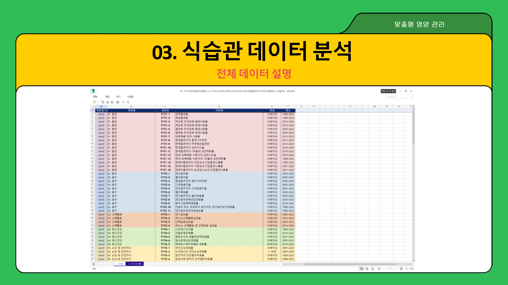
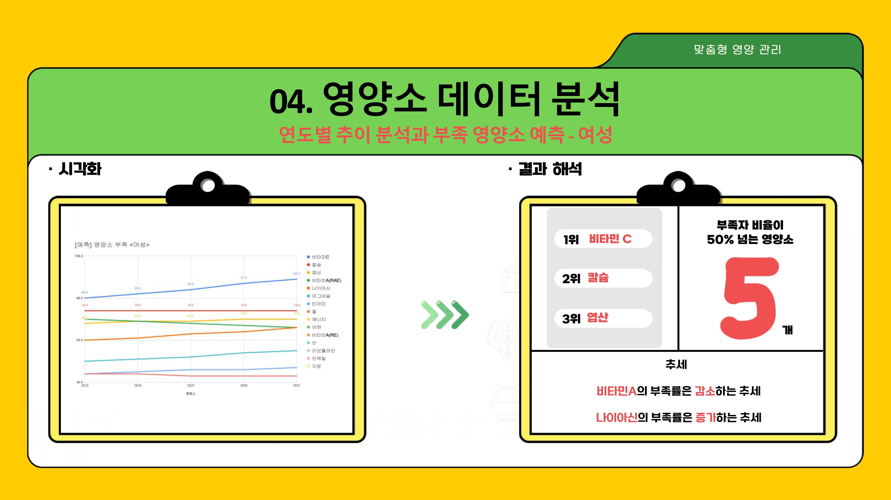
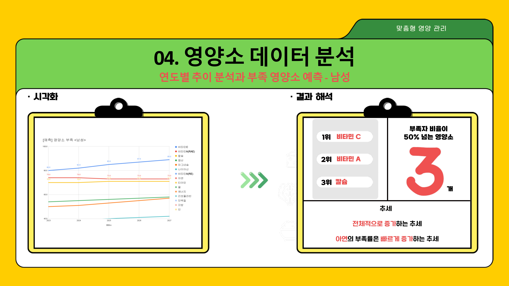

# Optimal-Nutrition
### SQL Project
  **/ Strategy / Optimization /**

---

## [데이터를 활용한 맞춤형 최적 영양 전략]
- **목적**

  - [국민건강통계] 데이터를 활용한 성별·연령별 최적의 영양 전략 제안

- **주요 특징**

  - 질병관리청의 [2022 국민건강통계] 데이터를 활용
  - 식습관 스타일 분석
  - 성별 부족 영양소 미래 예측
  - 성별·연령별 부족 영양소를 고려한 맞춤형 메뉴 추천
 
- **사용 기술**

  - SQL
  - Preprocessing
  - Corr / Regression

- **강화 역량**

  - 데이터 조회 및 가공 쿼리문(Query) 작성
  - 탐색적 데이터 분석을 통한 서로 다른 데이터의 연결과 활용
  - 상관분석 및 선형 회귀 분석 수행 및 해석
  - 데이터 기반 의사결정 지원

--- 

## 📄 프로젝트 문서

  <h6>※ PDF로 보시는 것을 추천드립니다 
   (하단 이미지의 품질에 한계가 있습니다)</h6>

 

  

 
  

   
   
   
   
   
   
   
   
   
   
   
   
   
   
   
   
   
   
   
   
   
   
   
   
   
   
   
   
   
   
   
   
   
   
   
   
  

---

## 📬 문의
 
